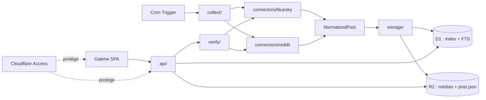

# Conception — Archivage de créateurs

## Vue d'ensemble
Un seul Cloudflare Worker porte tout le système : `scheduled()` collecte, `fetch()` sert l'API `/api/*`, et Workers Static Assets sert la galerie. D1 indexe, R2 stocke. Le même code tourne localement avec `wrangler dev`.



## Interfaces des connecteurs
Le code de référence est `src/connectors/types.ts` ; en voici l'essentiel.

```ts
export interface NormalizedMedia {
  kind: "image" | "video" | "gif";
  sourceUrl: string;              // version complète
  thumbUrl: string | null;        // miniature fournie par la plateforme
  width: number | null;
  height: number | null;
  thumbWidth: number | null;      // toujours null pour Bluesky
  thumbHeight: number | null;
  description: string | null;     // alt Bluesky, légende de galerie Reddit
}

export interface NormalizedPost {
  id: string;                     // "<plateforme>:<id natif>"
  platform: "bluesky" | "reddit";
  creatorId: string;
  nativeRef: string;              // URI at:// (Bluesky) ou fullname t3_ (Reddit), pour la vérification
  nativeId: string;               // identifiant court, utilisé dans les clés R2
  publishedAt: string;            // ISO 8601 UTC
  title: string | null;
  text: string;
  sourceUrl: string;
  media: NormalizedMedia[];
}

export interface ResolvedCreator { id: string; handle: string; displayName: string | null }

export type PostState = "active" | "deleted";

export interface FetchResult {
  posts: NormalizedPost[];        // plus récentes que le curseur, de la plus ancienne à la plus récente
  reachedCursor: boolean;         // faux si la limite de pages est atteinte avant le curseur (trou possible)
}

export interface Connector {
  readonly platform: "bluesky" | "reddit";
  readonly checkBatchSize: number;                            // références vérifiables par appel
  resolveCreator(handle: string): Promise<ResolvedCreator>;
  fetchSince(creator: { id: string; handle: string }, cursor: string | null): Promise<FetchResult>;
  checkStates(nativeRefs: string[]): Promise<Map<string, PostState>>;   // référence absente = supprimée
}
```

Le curseur est une date ISO conservée dans `creators.cursor`, mise à jour par `collect/` (`advanceCursor`), et non renvoyée par le connecteur.

## Correspondance par plateforme
| Élément | Bluesky | Reddit | Mastodon (et compatibles : Pixelfed…) |
| --- | --- | --- | --- |
| Créateur | DID via `app.bsky.actor.getProfile` | nom d'utilisateur (`/user/<nom>/about`) | `nom@serveur` ; identifiant numérique via `GET /api/v1/accounts/lookup?acct=` sur le serveur du créateur |
| Publications | `app.bsky.feed.getAuthorFeed`, sans réponses ; écartés : republications (`reason`), publications d'un autre auteur, citations d'un autre compte (`embed` de type `app.bsky.embed.record#view` dont l'auteur n'est pas le créateur). Une citation avec médias propres (`recordWithMedia`) est conservée | `/user/<nom>/submitted` | `GET /api/v1/accounts/:id/statuses?only_media=true&exclude_reblogs=true&exclude_replies=true`, pagination par `max_id` ; le serveur écarte déjà republications, réponses à autrui et publications sans média |
| Titre | aucun | `title` | `spoiler_text` (avertissement de contenu), sinon aucun |
| Texte | `record.text` | `selftext` | `content` (HTML converti en texte brut) |
| Médias | images et vidéo intégrées | image `i.redd.it`, galerie (`media_metadata`), vidéo `v.redd.it` | `media_attachments` : `image`, `video` et `gifv` (boucle sans son, traitée comme GIF) ; l'audio est ignoré |
| Description du média | `alt` de chaque image | légende de l'élément de galerie | `description` de la pièce jointe |
| Suppression | URI absente de `app.bsky.feed.getPosts` | `/api/info?id=t3_…` : auteur `[deleted]` ou contenu retiré | `GET /api/v1/statuses/:id` répond 404 ou 410 (toute autre erreur laisse le statut inchangé) |
| Conséquence | statut « supprimé », copie conservée | statut « supprimé », copie conservée (pas de purge en v1) | statut « supprimé », copie conservée (Q5) |

Mastodon : identifiants `mastodon:<serveur>:<id du compte>` (créateur) et `mastodon:<serveur>:<id du message>` (publication), car les identifiants numériques ne sont uniques que par serveur. Le champ `creators.handle` conserve `nom@serveur`, dont le connecteur déduit le serveur à interroger. `nativeRef` est l'URL de l'API du message (`https://<serveur>/api/v1/statuses/<id>`). Le nom du serveur est validé (nom d'hôte public, sans adresse IP ni port). Le quota se lit dans `X-RateLimit-Remaining` et `X-RateLimit-Reset` (horodatage ISO 8601).

## Modèle de données (D1)
Le schéma de référence est `migrations/0001_init.sql` (tables `creators`, `posts`, `media`, table virtuelle FTS5 `posts_fts`). FTS5 est validé en local avec D1.

Points notables :
- `creators.platform` : `bluesky`, `reddit` ou `mastodon`, validé dans le code (`isPlatform`) ; la migration `0002_platform_libre.sql` retire la contrainte `CHECK` de `0001`, pour que l'ajout d'une plateforme ne demande plus de reconstruire la table.
- Index : `0001` indexe les publications (par créateur et date, par date, par vérification) ; `0003_index_cles_media.sql` indexe `media.r2_key` et `media.thumb_r2_key`, car chaque média servi vérifie que sa clé appartient à une publication visible (sans index, chaque miniature lisait toute la table `media`).
- Reconstruction de l'index (`/api/admin/reindex`) : un créateur absent est recréé « désactivé », et son curseur avance jusqu'à la plus récente publication archivée (jamais en arrière).
- `creators.state` : `active`, `paused`, `deleted`, `purging` ; `creators.cursor` : date ISO de la dernière publication archivée.
- `posts.native_ref` : URI `at://` (Bluesky) ou fullname `t3_` (Reddit), utilisée pour la vérification des suppressions.
- `media.etag` : empreinte MD5 calculée par R2 ; `media.viewed_at` : première consultation ; `media.downloaded = 0` si le média dépasse la taille maximale ou était indisponible.

## Miniatures
Les Workers du plan gratuit ne conviennent pas au redimensionnement d'images (temps processeur limité). Les miniatures sont donc celles que fournissent les plateformes, archivées au moment de la collecte :

| Plateforme | Miniature | Version complète |
| --- | --- | --- |
| Bluesky, image | `thumb` de la vue de l'image (WebP du CDN) | fichier d'origine sur le serveur (PDS) de l'auteur, via `com.atproto.sync.getBlob` ; le CID du blob est extrait de l'URL `fullsize` du CDN. Si le CID est introuvable, repli sur `fullsize` (version recompressée) |
| Bluesky, vidéo | `thumbnail` de la vue vidéo | fichier d'origine sur le serveur (PDS) de l'auteur, via `com.atproto.sync.getBlob` |
| Reddit, image ou galerie | plus petite résolution de `preview` ou de `media_metadata` (≈ 320 px) | `i.redd.it` d'origine |
| Reddit, vidéo | image d'aperçu | `fallback_url` de `v.redd.it` (sans audio) |
| Mastodon, image | `preview_url` (≈ 400 px, dimensions dans `meta.small`) | `url` (original du serveur, sans recompression) |
| Mastodon, vidéo ou `gifv` | `preview_url` (image fixe) | `url` (fichier du serveur) |

Clés R2 : `.../media_01.<ext>` et `.../media_01.thumb.<ext>`, où l'extension se déduit du type MIME renvoyé par la source, sinon de l'URL, sinon du genre de média (`jpg` pour une image, `mp4` pour une vidéo). Les fichiers sont conservés tels que la source les sert : les images Bluesky sont les originaux de l'auteur (`.jpg`, `.png`, etc. selon le type renvoyé par son serveur), tandis que leurs miniatures viennent du CDN de Bluesky, qui répond en WebP (`.thumb.webp`). Sans miniature, la galerie affiche le média complet réduit en CSS (`object-fit: cover`), chargé paresseusement. Option à évaluer plus tard : un service de transformation d'images (vérifier son coût avant de l'activer).

## Stockage (R2)
- Clé : `<plateforme>/<créateur>/<AAAA>/<MM>/<AAAA-MM-JJ>_<id natif>/media_01.<ext>`, `.../post.json` (extension selon le type MIME, voir « Miniatures »).
- `post.json` reprend `NormalizedPost` plus `capturedAt`, `status` et les empreintes des médias : c'est la source de vérité, D1 se reconstruit à partir d'elle.
- Les médias sont diffusés de la plateforme vers R2 sans chargement complet en mémoire.

## Limites du plan gratuit
Par invocation : 50 sous-requêtes externes, 50 requêtes D1, 10 ms de temps processeur (l'attente réseau n'est pas comptée). En conséquence :
- déclencheur toutes les 15 minutes, petits lots ;
- `Budget` compte les appels sortants et `countingDb` compte les requêtes D1 (une par instruction d'un batch) ; avant chaque publication, le Worker vérifie qu'il reste de quoi l'archiver entièrement ;
- les médias passent de la plateforme à R2 en flux, sans passer par le code JavaScript ;
- lots réduits pour les actions de la galerie : vérification 25 publications, effacement 10, réindexation 12 objets par appel.
Sur Workers Paid, relever `MAX_SUBREQUESTS_PER_RUN` et `MAX_QUERIES_PER_RUN`.

## Flux de collecte
1. `scheduled()` charge les créateurs actifs.
2. Pour chaque créateur : `fetchSince(cursor)`, pagination jusqu'au curseur connu.
3. Pour chaque publication nouvelle : écriture des médias puis de `post.json` dans R2, puis insertion D1 (idempotente sur `id`).
4. Le curseur avance après chaque publication archivée : un arrêt en cours de route (budget, quota) ne perd rien et ne crée pas de doublon.
5. Un limiteur par plateforme lit les en-têtes de quota et suspend les appels au besoin.

## Consultation des médias
- État par média : `viewed_at` (un seul utilisateur, donc pas de table par utilisateur).
- État dérivé par publication : `aucun`, `partiel` ou `complet`, calculé à la requête (`COUNT` des médias non consultés).
- Marquage automatique à l'ouverture dans la visionneuse (`POST /api/views`, portée `media`), envoyé sans bloquer l'affichage ; en cas d'échec réseau, l'état local est conservé et renvoyé au prochain chargement.
- Marquage manuel en masse : `POST /api/views` avec `{ "scope": "media" | "post" | "creator", "id": "...", "viewed": true | false }`.

## Cycle de vie d'un créateur
| État | Synchronisation | Visible dans la galerie | Données |
| --- | --- | --- | --- |
| `active` | oui | oui | conservées |
| `paused` (désactivé) | non | oui | conservées |
| `deleted` (suppression logique) | non | non (sauf vue « Corbeille ») | conservées |
| `purging` (suppression physique en cours) | non | non | en cours d'effacement |

Transitions : `active` ⇄ `paused` ; `active` ou `paused` → `deleted` ; `deleted` → `paused` (restauration) ; tout état → `purging` → ligne effacée.

- La collecte ne traite que `state = 'active'`.
- Les requêtes de la galerie et la recherche excluent `deleted` et `purging` par jointure sur `creators`.
- Suppression physique par lots, comme la vérification : chaque appel efface jusqu'à N publications (objets R2 sous le préfixe du créateur, puis lignes `media`, `posts`, index plein texte) et renvoie `{ restantes }`. La galerie relance jusqu'à 0, puis la ligne `creators` est effacée. L'état `purging` permet la reprise après interruption.
- Avant confirmation, `GET /api/creators/:id/stats` fournit le nombre de publications, de médias et le volume à effacer.

## Synchronisation manuelle
- `POST /api/creators/:id/sync` collecte un seul créateur actif, avec un budget neuf (mêmes limites que `scheduled()`), et renvoie `{ archived, done }`. `done` est vrai lorsque le curseur est rejoint sans épuisement du budget.
- Le code de collecte d'un créateur est partagé avec la collecte planifiée (`collectCreator` dans `src/collect/`) : mêmes règles de curseur, de doublons et de quotas.
- La galerie rappelle l'endpoint tant que `done` est faux et que `archived > 0` (au plus 25 appels), puis affiche le bilan. Aucun traitement long côté serveur.
- Réponses : 404 (créateur inconnu ou en effacement), 409 (créateur désactivé ou dans la corbeille), 429 (quota de la plateforme), 502 (erreur de la plateforme). Un échec est enregistré comme pour la collecte planifiée (`last_error`), le curseur est conservé.
- Une synchronisation manuelle simultanée à un passage planifié est sans danger : l'insertion des publications est idempotente.

## Vérification des suppressions
- `POST /api/creators/:id/verify` traite un lot de 25 publications (les moins récemment vérifiées lors de la session en cours) et renvoie `{ startedAt, processed, deleted, remaining }`. Le corps de la requête porte `startedAt` (`null` au premier appel) : la galerie le renvoie à chaque appel, ce qui délimite la session de vérification.
- La galerie rappelle l'endpoint jusqu'à `remaining = 0` (ou `processed = 0`) et affiche la progression : aucun traitement long côté serveur, aucun déclenchement planifié.
- Bluesky et Reddit : statut `deleted`, copie conservée. Purge reportée (voir exigences).

## API
| Méthode | Route | Rôle |
| --- | --- | --- |
| GET | `/api/creators` | liste des créateurs et état de collecte |
| POST | `/api/creators` | ajout (`platform`, `handle`) |
| PATCH | `/api/creators/:id` | activer ou désactiver (`active` ⇄ `paused`) |
| GET | `/api/creators/:id/stats` | publications, médias et volume (avant suppression) |
| DELETE | `/api/creators/:id?mode=logical` | suppression logique |
| POST | `/api/creators/:id/restore` | restauration d'un créateur supprimé logiquement |
| POST | `/api/creators/:id/purge` | suppression physique par lot (corps : `{ "confirm": "<handle>" }`) |
| POST | `/api/creators/:id/verify` | vérification par lot |
| POST | `/api/creators/:id/sync` | synchronisation manuelle d'un créateur actif (réponse : `{ archived, done }`) |
| GET | `/api/posts?creator&platform&from&to&q&status&unviewed&cursor` | liste paginée, avec pour chaque publication ses miniatures, le nombre de médias et le nombre non consultés |
| GET | `/api/posts/:id` | détail |
| GET | `/api/media/<clé R2>` | diffusion d'un média ou d'une miniature (en-têtes de cache longs, contenu immuable) |
| POST | `/api/views` | marquage consulté / non consulté (média, publication, créateur) |
| POST | `/api/admin/reindex` | reconstruction de l'index D1 depuis les `post.json`, par lots (corps : `{ "cursor" }`) |

## Galerie
SPA Vite en TypeScript, servie par Workers Static Assets. Écrans : liste filtrable, fiche publication, gestion des créateurs (ajout, bouton « Synchroniser maintenant », désactiver/réactiver, supprimer avec choix logique ou physique, corbeille avec restauration), fiche créateur (avec bouton « Vérifier les suppressions »). Deux adresses mènent à la galerie d'un créateur : `/createur/:id` et `/?creator=<id>` (filtre « Créateur ») ; les deux affichent le même en-tête (nom, plateforme, identifiant, actions de consultation). Le nom du créateur sur chaque tuile est un lien vers sa page. La suppression physique demande de retaper le nom du créateur. Mise en page conçue d'abord pour le mobile ; grille de 2, 3, 4 puis 5 colonnes aux points de rupture de 640, 1024 et 1536 px.

## Configuration et secrets
| Élément | Où | Versionné ? |
| --- | --- | --- |
| Créateurs suivis | table `creators` (D1), gérée depuis la galerie | non |
| Réglages non secrets (fréquence, seuils, tailles max) | `vars` dans `wrangler.jsonc` | oui (valeurs par défaut) |
| Identifiants des ressources (D1, R2, domaine) | `wrangler.jsonc`, généré depuis `wrangler.example.jsonc` | non (`.gitignore`) |
| Secrets Reddit (client, secret) | `wrangler secret put` ; en local `.dev.vars` | non (`.gitignore`) |
| Jeton de déploiement Cloudflare | secrets du dépôt GitHub (`CLOUDFLARE_API_TOKEN`, `CLOUDFLARE_ACCOUNT_ID`) | non |

## Présentation dans la galerie
- **Tuile simple** : la miniature, avec une pastille « nouveau » tant que le média n'est pas consulté ; une fois consulté, la pastille disparaît et la tuile est légèrement atténuée.
- **Tuile de groupe** : la miniature du premier élément, un effet de pile (deux bords décalés derrière la tuile), une pastille avec l'icône de pile et le nombre d'éléments, et l'état « 3 non vus » ou « partiel » tant que tout le groupe n'a pas été consulté.
- **Visionneuse** : superposition plein écran ; version complète chargée à l'ouverture, élément suivant préchargé. Pour un groupe : position « 2/5 » et bande de miniatures cliquable ; suivant/précédent parcourt le groupe, puis passe à la publication voisine. Titre, texte, description du média et lien source dans un panneau repliable.
  - **Fermeture par clic extérieur** : un clic sur le fond autour de l'image ferme la visionneuse. Comme l'élément image occupe toute la zone et que l'image y est dessinée ajustée (`object-fit: contain`), les marges d'ajustement comptent comme « en dehors » : `isInsideContain` (`web/src/zoom.ts`) calcule le rectangle réellement dessiné. Sont aussi « en dehors » : le fond de la barre du haut, de la zone centrale et de la fenêtre. Ne ferment pas : les boutons, liens, la vidéo, la bande de miniatures et le panneau de détails. Le curseur redevient normal au-dessus des marges.
  - **Loupe** (images seulement) : le bouton, un clic sur l'image ou la touche `Z` (ou `+`) agrandit l'image à sa pleine résolution, soit un pixel de l'image pour un pixel de l'écran (largeur naturelle divisée par `devicePixelRatio`), centrée sur le point cliqué. L'image se parcourt au glissement de la souris, au défilement ou au toucher ; `-`, un nouveau clic ou Échap (qui ne ferme la visionneuse qu'au second appui) reviennent à l'affichage ajusté. En mode agrandi, les flèches du clavier déplacent l'image au lieu de changer de média et le balayage tactile ne change pas de média. Passer à un autre média ramène à l'affichage ajusté. Le calcul du point de départ du défilement est dans `web/src/zoom.ts`.
- L'état de la visionneuse est dans l'URL (`/publication/:id?media=2`), pour que le bouton Retour la ferme.

## Sécurité
- Cloudflare Access devant l'ensemble du domaine (galerie et API). Le Worker vérifie aussi le jeton Access (signature RS256, audience, émetteur, expiration) sur chaque requête, y compris pour la galerie (`run_worker_first`), et `workers_dev` est désactivé. En local, `REQUIRE_ACCESS=false` (dans `.dev.vars`).
- Les clés publiques d'Access sont mises en cache une heure (Cache API). Un identifiant de clé absent du cache (rotation par Cloudflare) provoque une relecture à la source, au plus une fois par minute, pour ne pas bloquer l'accès jusqu'à l'expiration du cache.
- En-têtes de sécurité sur toutes les réponses (`src/security.ts`) : `Content-Security-Policy` stricte, `X-Content-Type-Options: nosniff`, `Referrer-Policy: no-referrer`, `X-Frame-Options: DENY`. La politique part de `default-src 'none'` et n'autorise que le site lui-même pour les scripts, images, médias et appels d'API, plus Google Fonts pour la feuille de polices (`fonts.googleapis.com`) et les fichiers de polices (`fonts.gstatic.com`). Aucun script ni style en ligne n'est permis ; la galerie n'en utilise pas (les styles posés par le code passent par l'API CSSOM, que la politique n'interdit pas). `frame-ancestors 'none'`, `base-uri 'none'`, `form-action 'self'`. Un test (`security.test.ts`) vérifie que `web/index.html` et `styles.css` restent compatibles avec la politique.
- Toutes les requêtes qui modifient des données (`POST`, `PATCH`, `DELETE`) exigent `Content-Type: application/json`, même avec un corps vide (`{}`), ce qui bloque les envois de formulaires depuis un autre site.
- Identifiants Reddit en secrets Wrangler.
- Aucune route publique.

## Erreurs et observabilité
- Classes d'erreur typées par cause (quota, introuvable, plateforme).
- Journaux JSON structurés par créateur et par exécution ; observabilité Workers activée.

## Tests
État actuel : tests unitaires Vitest exécutés sous Node (`npm test`), dans `test/`, avec des données écrites à la main et une base D1 factice.
- Connecteurs (`bluesky.test.ts`, `reddit.test.ts`, `mastodon.test.ts`) : correspondance des réponses d'API vers `NormalizedPost`, y compris republications, citations d'un autre compte, republications croisées Reddit, originaux Bluesky, vidéos, galeries Reddit et détection d'une publication Reddit supprimée. Pour Mastodon, en plus : validation des noms de serveur, conversion du HTML, quota en horodatage ISO, et le connecteur entier avec des appels réseau simulés (résolution, pagination, curseur, vérification des suppressions). Aucun test de suppression côté Bluesky. Les réponses sont des objets écrits dans les tests, non des réponses enregistrées.
- Stockage et API (`storage.test.ts`) : clés R2, extensions, `Budget` et `countingDb`, limiteur de quota, requête de recherche FTS, curseur de pagination et bornes de dates.
- Collecte et synchronisation manuelle (`sync.test.ts`) : refus selon l'état du créateur, doublons, avancée du curseur, publications sans média, arrêt par budget. La base D1 y est simulée.
- Contrôle Access (`access.test.ts`) : jetons RS256 générés dans les tests (valide, falsifié, expiré, autre audience, autre émetteur, clé inconnue), et cache des clés avec relecture en cas de rotation (Cache API et `fetch` simulés).
- Loupe (`zoom.test.ts`) : taille à la pleine résolution, repérage d'un clic dans l'image ajustée, marges d'ajustement, défilement initial.
- Galerie : contrôle visuel manuel aux largeurs 390 et 1280 px, et essais manuels de la visionneuse sur une instance locale ; non automatisé.

À venir (tâche 1.7 du plan) : tests d'intégration dans le runtime Workers avec D1 et R2 réels (`@cloudflare/vitest-pool-workers`), et réponses d'API réelles enregistrées comme fixtures.
